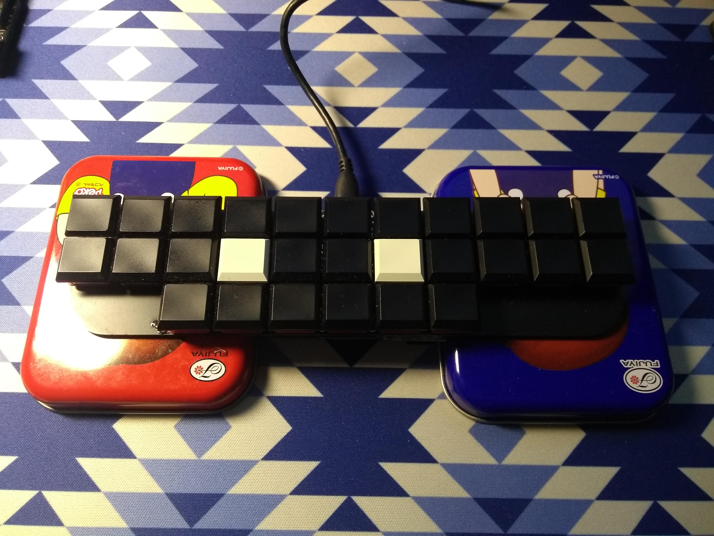
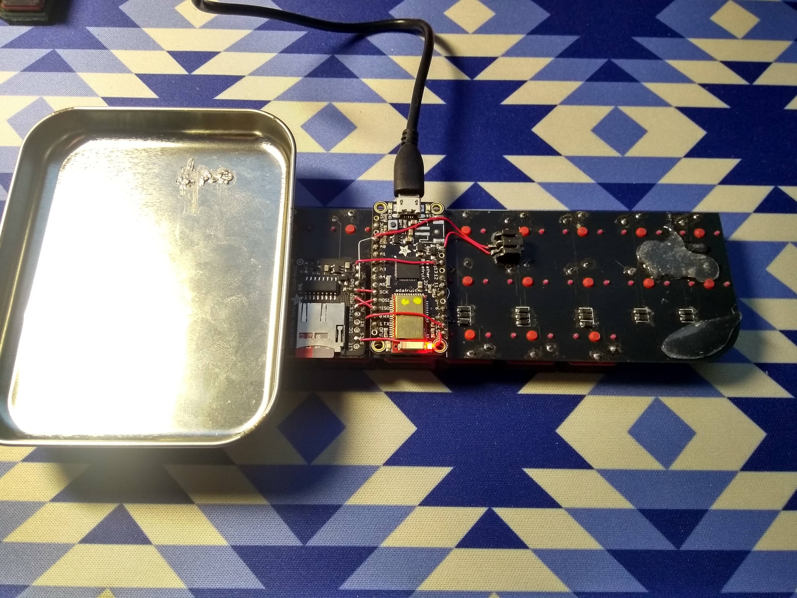

# Stenophone

This is a experimental version aimed to bring hardware steno to phones, so that one might be able to steno on the go (like on the bus, generally when you don't have a place to sit down). The idea is that you put this keyboard on the back of your phone, and your fingers reach to the back to press the keys, and your thumb will go over the phone to reach the vowels. This version is really only for testing out the idea, therefore a lot of the design aspects are still incomplete (for example see the battery location on the back). This version only differs in layout compare to the other ones, and uses the same steno firmware. It still uses BLE, as the plug on the phone will be simply blocked by hands.

# Version 2

Version 2 is a much better improvement over the first. This time I chose a split layout, but on the same board so I may use it on the go. The 2 halves are rotated 20 degrees each, so my hands won't have to bend much since it's not a actual split board. Like [my split keyboard](https://github.com/crides/fissure), this version also includes high levels of columnar stagger. I also put the MCU back to a normal position, so I don't have to worry about the underside of the keyboard anymore. This version also added a JST Li-ion battery plug (although in a weird position), a OLED for status display, a SOIC8 for experimenting with a QSPI flash, and a sdcard slot under the OLED screen.

Note the location of the sdcard; this is when it's not properly inserted to show the location. Also note the weirdly large battery and JST plug location.

# Version 1

The version 1 board is just a experimental board, with a small form factor while keeping the 11 column of keys needed. The number bar is missing, just like the Georgi, and the number keys are placed at either side of the vowels. As I was just starting to practice steno, I didn't know much about the dimension of a steno keyboard that I would feel comfortable using, so I simply used a ortholinear layout. In order to keep the form factor small, I tried to put the MCU under the PCB, so that it doesn't take any extra space on the PCB itself. But since I'm not used to doing that, it caused some issues when I later tried to modify the board and in normal usage.

Note the candy boxes I used to lift the board up so it's stable. Also note the sdcard slot and the bodges I did to accomodate the dictionary in the firmware.
