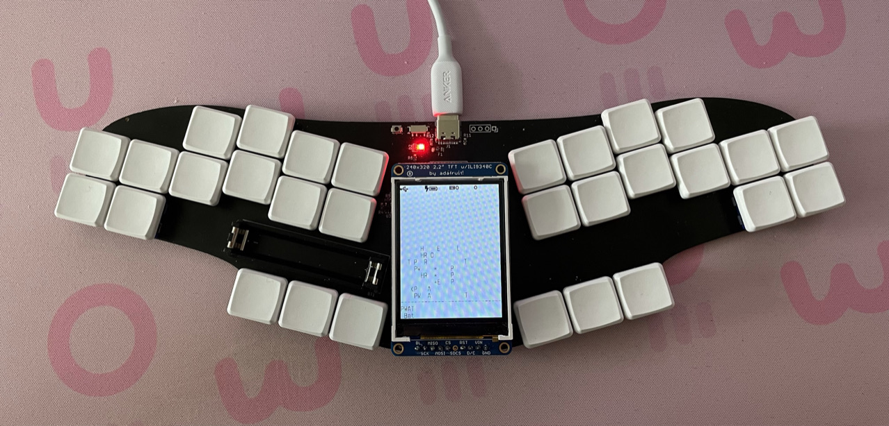
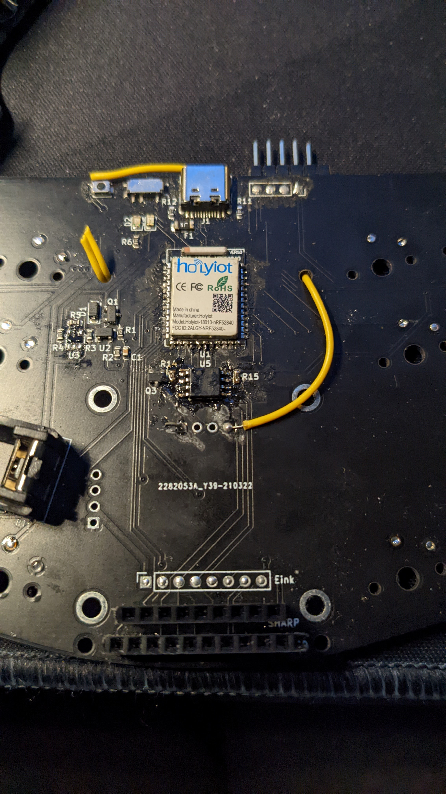
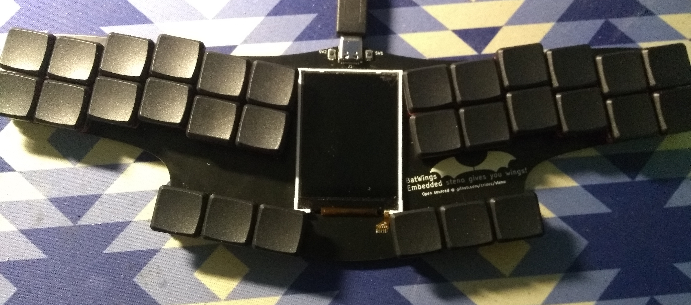
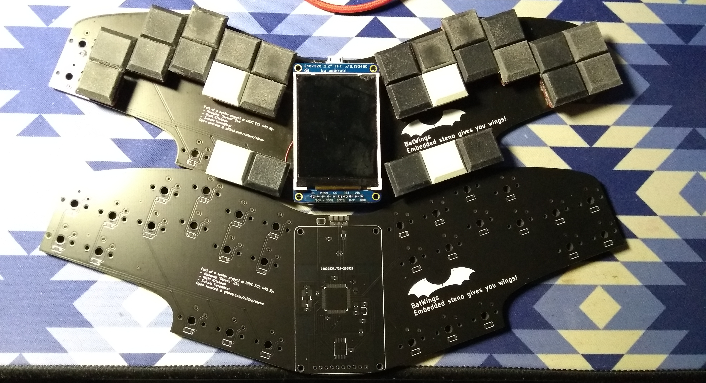
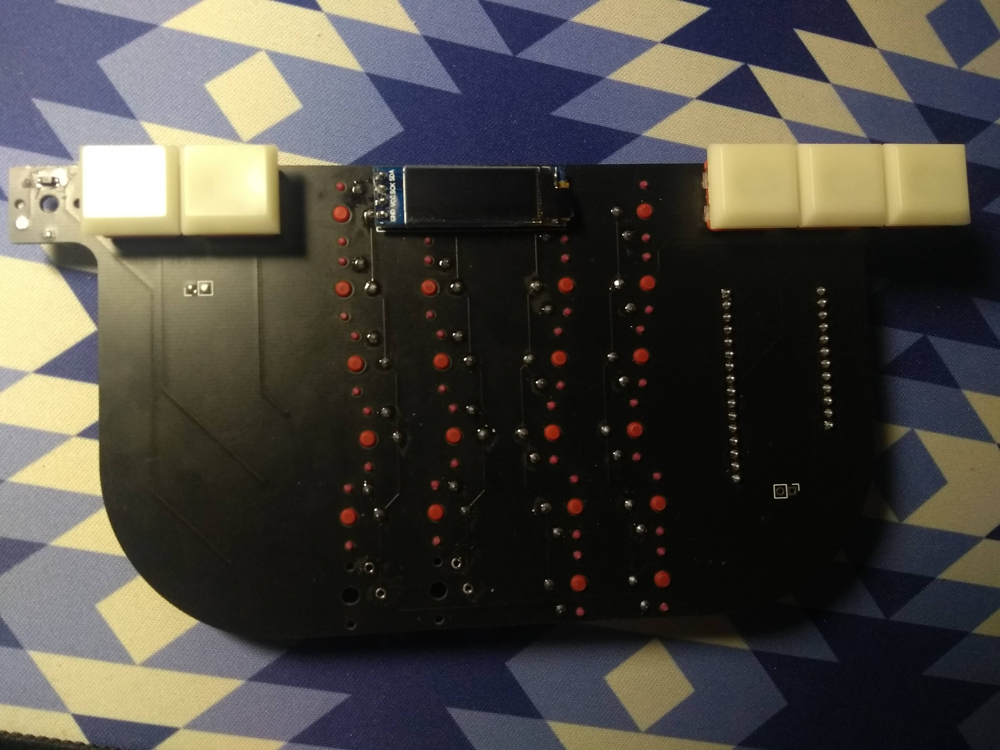
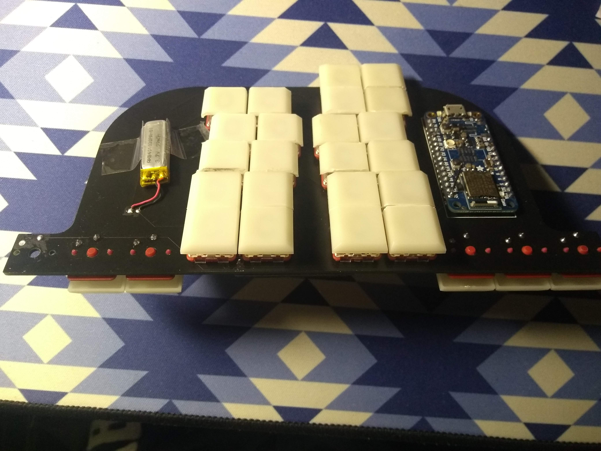
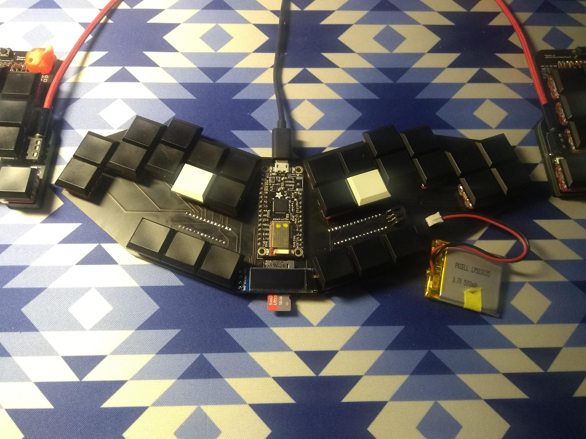
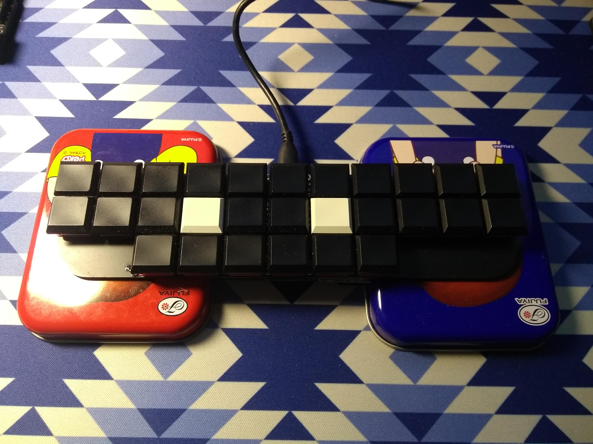
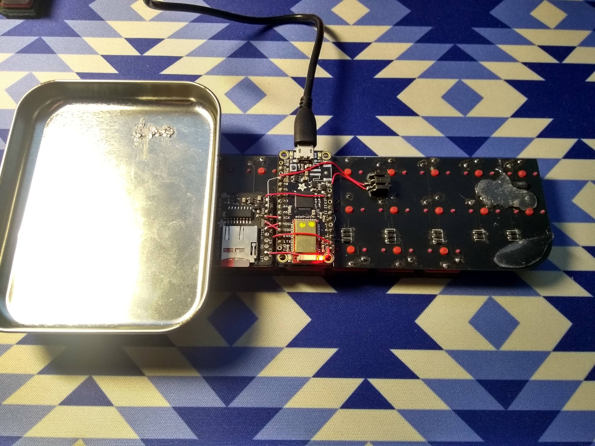

# Embedded steno boards

These are the steno keyboards I designed and built, almost all of which has some form of hardware support for a embedded steno engine. These are just a list for more or less steno centric designs though, you can find my other boards using embedded steno like the [fissure v3](https://github.com/crides/fissure) and the [fusion](https://github.com/crides/fusion).

## Version 4

Version 4 is/are being designed as a more general board for others to use. There have been some people in the community requested me to sell some form of embedded steno board, and hardware vendors have yet to integrate the system (which on hardware is at least a flash chip). So these design(s) are meant to be easier to manufacture or assemble for the people printing their own.

## Version 3b / Bluebat

Picture from Jen/@sammdot: 

This is the screen testing platform for future designs with BLE versions of the bat. It was meant to compare the characteristics and power consumption of OLEDs, Eink display, Sharp memory display and the 2.2 inch LCD used in version 2 & 3. This version is not actually open sourced, as it was meant to simply be a personal testing board. The only reason it's here is because one was built for Jen/@sammdot as she requested one bat for polishing the UI (and the ATMega32u4 based ones, i.e. all previous versions, don't have enough flash for a good UI to be built without compromising other features).

## Version 3

Version 3 is the public testing version. This is done so that I can get more feedback from the community. This version uses basically the same design from version 2, but adopts a [raw screen module](https://www.aliexpress.com/item/32417585937.html) so that the cost of building is much cheaper. The other components are pushed to the back of the board as I imagine there wouldn't be much room at the front. This caused me a bit of trouble as I still want to put the diodes for the switches at the front, underneath the switches so that they are hidden. But that means I needed to hand solder the diodes while the other components are assembled at JLCPCB (they only support one sided assembly). As this was a public version, I changed the stagger of the keyboard to mimic that of Georgi's, but retained the relative position between thumbs and fingers (specifically thumb home and index home).

This version has been sent out to 9 other testers (I have one for testing) which helped me fix the dictionary downloader and polish the dictionary editing interface a bit more.

## Version 2

Version 2 is the one done as a class project (ECE445, Senior Project Labotory) and you can see the class number as a branch containing the work done there (it's been merged a long time ago of course). This is also the point where I ask the community for a name of the board, and that's where BatWings (or simply bat) comes from, from a suggestion by Jane/Germ/HardAsMagnets.

The main difference of this version is that it embeds the MCU onto the board itself (per course hardware requirements), includes a [much larger screen](https://www.adafruit.com/product/1480), and starts to use Bezier curves all over the board. Note that the one pictured is the first revision where the design is not electrically sound: I forgot a level shifter for the 5V MCU to interface with a 3.3V flash. This was not a problem before as the feather I was using runs the MCU at 3.3V and 8MHz. You could see the bodge wires under the screen if you look closely

This is also the point where me and my team added command formats so that the firmware can start to support a larger portion of Plover's builtin commands, and changed the dictionary format to a simpler and more regular one based on a single level of hashmap.

## Stenophone

This is a experimental version aimed to bring hardware steno to phones, so that one might be able to steno on the go (like on the bus, generally when you don't have a place to sit down). The idea is that you put this keyboard on the back of your phone, and your fingers reach to the back to press the keys, and your thumb will go over the phone to reach the vowels. This version is really only for testing out the idea, therefore a lot of the design aspects are still incomplete (for example see the battery location on the back). This version only differs in layout compare to the other ones, and uses the same steno firmware. It still uses BLE, as the plug on the phone will be simply blocked by hands.

## Version 1

Version 1 is a much better improvement over the first. This time I chose a split layout, but on the same board so I may use it on the go. The 2 halves are rotated 20 degrees each, so my hands won't have to bend much since it's not a actual split board. Like [my split keyboard](https://github.com/crides/fissure), this version also includes high levels of columnar stagger. I also put the MCU back to a normal position, so I don't have to worry about the underside of the keyboard anymore. This version also added a JST Li-ion battery plug (although in a weird position), a OLED for status display, a SOIC8 for experimenting with a QSPI flash, and a sdcard slot under the OLED screen.

Note the location of the sdcard; this is when it's not properly inserted to show the location. Also note the weirdly large battery and JST plug location.

## Version 0

The version 0 board is just a experimental board, with a small form factor while keeping the 11 column of keys needed. The number bar is missing, just like the Georgi, and the number keys are placed at either side of the vowels. As I was just starting to practice steno, I didn't know much about the dimension of a steno keyboard that I would feel comfortable using, so I simply used a ortholinear layout. In order to keep the form factor small, I tried to put the MCU under the PCB, so that it doesn't take any extra space on the PCB itself. But since I'm not used to doing that, it caused some issues when I later tried to modify the board and in normal usage.

Note the candy boxes I used to lift the board up so it's stable. Also note the sdcard slot and the bodges I did to accomodate the dictionary in the firmware.
