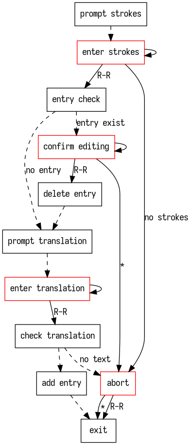

# Firmware

This is (as I know of) the first open source attempt of putting a stenography engine into a keyboard. Heavily inspired by Plover and Dotterel, this is **not** an attempt at a full featured engine, rather an engine that include the very basic features. The system is originally designed for a ATMega32u4 + a 16MB SPI NOR flash, based on the [QMK firmware](https://qmk.fm), however it's possible to port it to other hardware. Currently, the available features are:
- Strokes to text translation
- Some support for Plover-style commands. These are compiled into the dictionary as internal commands, and all but the retroactive commands are supported, with slightly different semantics.
- Optional screen UI displaying paper tapes and last translation.
- Optional on-board dictionary editing through the screen. Possible to add, remove or edit (remove & add) entries, but the translation is currently text only.
- Optional dictionary import possible through a Mass Storage Device (i.e. the keyboard can show up as a USB drive, allowing the new dictionary to be "copied" in without additional software)
- English orthography, i.e. automatically correcting the spelling using the word and suffix without additional entries.

Conversion of on-board dictionary back to Plover JSON and on-board entry lookup (and maybe suggestions) are planned for the future but not implemented.

## Usage

### Dictionary Loading

To load your personal dictionary onto the board, you need to grab the [compiler](../compiler). After compiling your dictionary into a binary file, you need to get the keyboard into dictionary loading mode (if your hardware supports it). On the public testing Bat board, this is done by plugging in while holding the button to the left of the USB port. The keyboard will then show up as a Mass Storage Device (i.e. a USB drive-like thing). Just drag the compiled dictionary into the drive, and waiting for the transfer to complete will complete the process. Note that this is a fake USB drive, and any files shown doesn't work like normal files, i.e. deleting and renaming won't work. It's just a standard workaround to flash embedded devices with binaries so that no additional software is needed.

With your personal dictionary loaded, just use the keyboard to steno like you would with Plover!

### Dictionary Editing

Use `TKUPT` (Plover default) or whatever you have `{PLOVER:ADD_TRANSLATION}` mapped to to start editing the dictionary. The compilier substitutes this commands to editing the dictionary because this would make it easier for Plover users, even though the behavior is very different. After entering the dictionary editing mode, you'll be asked to enter the strokes, as you would in the Plover interface. After pressing `R-R` (enter; key is hardcoded), the entry would be searched for, and if the entry doesn't exist, as is the case in adding a new entry, the user would be asked to enter the translation. Again, note that only pure text is supported currently. If an entry is found, a prompt would show up asking if the user want to edit the corresponding entry. If `R-R` is pressed, then the old entry is removed, and the interface would proceed to translation entering stage. If `*` (also hardcoded) is pressed, then the operation would be aborted. During the translation entering stage, if `R-R` is pressed, then the translation would be checked. If there's no text entered, then nothing would be done at this stage. Otherwise, the text would be added as a translation to the strokes entered before.

The flowchart below should help explaining things better (red boxes are actual states in the firmware, dashed arrows are automatic transitions, and solid lines are transitions that correspond to user actions).



### Compiling the Firmware

Make sure you have the requirements for compiling and flashing firmware. This should be GNU `make`, `avr-gcc`, `avr-binutils`, and `dfu-programmer`. Then you need to use [my QMK fork](https://github.com/crides/qmk_firmware), and put/link this directory in/from `qmk_firmware/keyboards`. Configure the matrix in `config.h`, and modify keymaps in `keymaps/default/keymap.c` if needed.

Go to `qmk_firmware`, and do `make steno:default:dfu` to flash the firmware (I'm assuming that `qmk_firmware/keyboards/steno` is/links to this directory). You'll need to press the reset button on the keyboard to enter bootloader.

## Porting

You are likely to be using hardware already supporting the firmware. If not, the system relies on several things:
- Key holding/releasing using HID scan codes. This should be a thin (or none) wrapper around the firmware you are basing on.
- Storage handling interface. This is defined in `store.h`, and although the system is originally built on a single 16MB SPI NOR flash, you can theoretically use any storage backend or any region of one.
- Display/UI handling interface. This is defined in `disp.h`, and handles the UI at each stage when the interface need to change.

### Building Compatible Hardware

Although the system is designed for a MCU that has limited RAM and computing power, the code should be standard (but with lots of `const`) C99, and should be easily portable to any platform, as long as the requirements above are satisfied. A storage device is also needed, and I used the [W25Q128JVSIQ](https://lcsc.com/product-detail/FLASH_Winbond-Elec-W25Q128JVSIQ_C113767.html/). You can also optionally include a screen for paper tape display and dictionary editing.

## Background

Shortly after I built the [first version](../pcb/README.md#Version-1) of the steno board, I got the idea of building a plug-and-playable steno keyboard. The idea was that I can compile the dictionary into a special format that's easier for the MCU to process, and load it on to a SD card. When I type on the keyboard, the MCU then doesn't send the strokes to the PC for Plover to process, but rather process the translation by itself, and send the actual key codes to the PC. Note that I originally planned to do this on a 3.3V ATMega32u4, which runs on only 8MHz, 2.5kB of RAM, and 28kB of available application program space (the other 4k devoted to bootloader).

## Implementation

### Version 2

The core change of this version is to add the ability of editing the dictionary. Due to the nature of flash devices, it's important to keep things aligned to the erase unit size (which, for the flash I've been using, is 4KB).

The core structure has been changed to a flat hashmap for easier manipulation. The whole dictionary is divided into 3 parts: entry buckets, value blocks, and some metadata.

The entry buckets are 1M (read: 2^20) entries of 4 byte long each. Each entry (if not `0xFFFFFFFF` i.e. erased value) include a 20-bit value block offset, 4-bit stroke length, and a 8-bit entry length. Each entry is indexed by the lower 20 bits of the FNV-1a hash of the whole stroke sequence for an entry, moving on to the next bucket if there's a collision (open addressing).

The value blocks are 16-byte blocks, totalling 11MiB, managed by a block allocator that sits in the metadata section. Each bucket can point to any number of blocks that's a power of 2, i.e. each entry can take 16, 32, 64 etc. bytes. The larger blocks are always aligned to erase unit boundaries, as guaranteed by the block allocator. Each value block contains the raw strokes, the entry attributes, and the entry itself.

The block allocator is a 4-level 32-ary buddy system allocator, which will support 2^20 total blocks. This is done so that the implementation can be easier at the slight price of wasted space. At each level there are 32^n (0 &lt;= n &lt; 4) 32bit words, where each bit represent if its children is not fully used, or if the block is not used if at the bottom level. When a new block needs to be allocated, the tree is traversed to find a 1 in all the top levels, and then descend 1 level down until the bottom level, and try to find a series of 1s that matches the block size and is aligned. If not, then it'll backtrack to find a new location. After the block is allocated, all the bits corresponding to the block will be set to 0, and the bits on the upper levels are set accordingly.

The searching algorithm for stroke is a lot different from the last version. Since looking up one stroke sequence is a lot cheaper, determining the output became searching the last 1, 2, ... n strokes in the dictionary. When searching for an stroke sequence, the hash of the sequence will be computed, and the lower 20 bits will be multiplied with 16 and added `0x40000` (4MiB) to get the start of the value block. If a valid entry is found, the stroke length will be compared with the current strokes. If there's a match, then the value block will be read to check if the strokes match. If there's a match then the entry will be read.

Editing is fairly easy thanks to the new dictionary structure. Adding is just allocating a new block, writing the strokes and entry to the block, generating a bucket entry and writing it to a bucket. Removing can be as simple as removing the bucket entry (writing all `0x00`). Properly removing the entry would need erasing the bucket entry and value blocks, and freeing the blocks in the allocator. Editing is just removing and adding most of the time, but could be reduced down to just erasing and rewriting the value blocks if allocating new blocks is not needed.

Dictionary loading in version 2 uses a MSC with UF2. The device will enumerate as a HID and MSC when plugged in, and users can just drop the compiled dictionary in. This is technically only needed for the first time, and the OS reading the drive significantly slows down the startup process, and this shall be changed in the future.

Orthography was to be implemented inside firmware. The plan was to move the orthographic rules from the compiler into the firmware itself. The regex rules can be done by rewriting them in code, and the simple rules and the word list are to be restructured as prefix trees as ha are read only. The nature of the words means that a prefix tree will save a lot of storage space, but also make the searches broken into a lot of random reads. A better design still needs to be researched.

#### Issues

- Deallocation of the blocks aren't fully implemented, especially for the buckets and reset the bits in the allocator.
- The weird firmware issue in the last version seem to have went away.
- The storage space usage has gone up by a bit. This is partially due to node deduplication being not trivial. Turns out there is 680kB of repeated entries in the Plover dictionary (duplicated entries are not really a problem for the dictionary, but a potential problem for the underlying system).

### Version 1

This firmware uses the [QMK firmware](https://qmk.fm), but strips off any useless features for a fully steno board, like layers. It uses the steno driver, but intercepts all the strokes by using `send_steno_chord_user`. Instead of sending them off to the host, the firmware performs several look ups in the dictionary, parses the entry, and outputs the needed key strokes. Loading dictionaries is done by implementing a raw HID device and receiving packets from a PC using the compiler.

The binary dictionary is structured as a prefix tree on the strokes. The prefix tree structure was chosen because I thought it would make it easier and more space efficient to manage the dynamically sized stroke sequence better, and the nature of steno means there will be a fair amount of overlapping between the prefix of the strokes. Each sequence of strokes is broken down into edges, which each one representing one stroke. Each node will either be an entry in the dictionary or an intermediate node on the path to one. Each node will contain a hashmap of a stroke mapping to the address of a child node, or a linear array of the stroke and address pairs sorted on the stroke if the number of children is less than 8. This is done to save space on the smaller nodes, and there are a lot of them in the Plover dictionary. In order to achieve good performance, the hash is calculated using the FNV-1a hash function, and the capacity of the hashmap is the prime right after N times the number of children, where N was chosen to be 6 in the latest revision. The entry and the length, along with the capacity (not size) of the hashmap or the size of the linear array and all of its key-value pairs, and finally the attributes (the next section; not in order).

The header for a node, that is, everything before the dynamically sized stuff (i.e. entry and children). This is immediately followed by the entry with length `entry_len` and the children structure (which could be either a hashmap or a sorted array).
```c
typedef struct __attribute__((packed)) {
    uint32_t node_num : 24;
    uint8_t entry_len;
    attr_t attrs;
} header_t;
```

In order to support Plover commands but to reduce the complexity, those are implemented as attributes of a entry (with the capitalization and space control attributes). They are simply flags in the entry of the compiled dictionary, and they are evaluated when the outputs are you evaluated, changing the output or changing the state of the system which will go on affecting the next output along with the next entry attributes.

The searching algorithm is meant to take advantage of the prefix tree structure of the dictionary. Instead of looking up the stroke sequence directly which would require walking the tree multiple times, we keep an internal array of "search nodes". Each time a user inputs a stroke, the firmware will look up the stroke in the children of the search nodes and the root node. If any new nodes are found, those become the new search nodes. Out of the new search nodes, the one with the longest match with an entry will be used, and the output will be evaluated and sent to the host. This way of searching strokes makes more efficient, but also added some interesting problems to how a search path should be terminated, and how an entry is actually selected.

#### Issues

Sometimes the firmware goes crazy and seems to get stuck in an infinite loop, although there doesn't seem to be anything in my firmware that creates one directly. It could be one related to unhandled state transitions or something like that.

Simple editing could be easily supported, but was not. As there are a lot of empty space in the hashmap, it's easy to put a new node at the very end of the dictionary (but there was no way of knowing that quickly...), and overwrite an empty entry in the hashmap. However, if there are too many children in a node, it's possible to just add a new node at the end, but the whole old node will be wasted, and it's hard to reuse that space again, as the node is not aligned to erase unit boundaries.

## Future Work

- Add optimization that reuse the common parts of words. Currently, whenever a new entry is inputted, the old entry would always be deleted, regardless whether there's a common part or not. This is because, in order to save memory, only the length of the previous stroke is recorded, and the easiest way would just to delete what we had entered before and reenter the whole thing. The easiest way to add the optimization is to make a buffer for the previous output, and compare how much has changed. This however would not work when undos have occurred. The next easiest solution would be to read in the previous entry every time we want to output something, and evaluate the entry and do the comparison. This however, might cause performance issues. The most complete way would be to store the entire output in the previous history entry.
